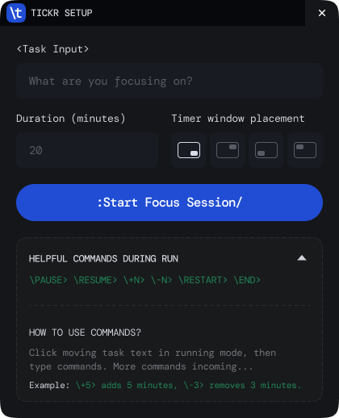
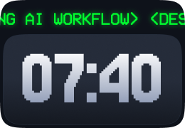
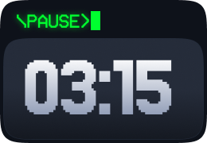

# Tickr

A tiny, always-on desktop timer that lives on your screen.

Built with a simple idea:  
**your timer should not hide in a tab.**

---

## What is Tickr?

Tickr is a minimal ambient timer designed to stay visible while you work.

- Sits on your screen (you choose BR / TR / BL / TL)
- Always on top
- Shows time left for your active task
- Includes a scrolling LCD-style task strip
- Controlled through lightweight command interactions

It is not a productivity suite.  
It is a **tiny companion that keeps you accountable.**

---

## Why this exists

I juggle multiple things constantly and kept missing timers.
So instead of opening tabs and switching contexts, I built something that simply stays visible.

No friction. No switching. Just focus.

---

## Features

- ? Countdown timer (MM:SS)
- ?? Scrolling task display (LCD-style)
- ?? Always-on-top desktop window
- ?? Minimal, distraction-free UI
- ? Lightweight Tauri app
- ?? Visual urgency in final seconds
- ?? Command-driven controls in running mode

---

## Commands

Click the moving LCD task text in running mode, type a command, then press `Enter`.

- `\PAUSE>` pause timer
- `\RESUME>` resume timer
- `\HALF>` set remaining time to half
- `\RUSH>` jump remaining time to 15s
- `\BREAK N>` start break timer for N minutes
- `\BACK>` return from break to saved focus session
- `\RESET>` reset to original duration
- `\RESTART>` restart from full duration
- `\END>` close running window
- `\+N>` add N minutes
- `\-N>` subtract N minutes

Examples:

- `\BREAK 5>`
- `\+10>`
- `\-3>`

---

## Tech Stack

- Tauri (Rust + WebView)
- HTML
- CSS
- Vanilla JavaScript

---

## Getting Started

### 1. Clone the repo

```bash
git clone https://github.com/nastarkk/Tickr_App.git
cd Tickr_App
```

### 2. Install dependencies

```bash
npm install
```

### 3. Run in development

```bash
npm run tauri dev
```

---

## Build

```bash
npm run tauri build
```

Build artifacts are generated under:

- `src-tauri/target/release/bundle/msi/` (Windows)
- `src-tauri/target/release/bundle/` (platform-specific outputs)

---

## Journey + Screenshots

1. Open setup window
2. Enter task + duration + placement
3. Start focus session
4. Control timer from LCD command input

### Setup Window



### Running Window



### Command Input



---

## Contributing

Contributions are welcome:

- Improve UI polish
- Add useful commands
- Fix bugs and edge cases
- Improve docs and packaging

See `CONTRIBUTING.md`.

---

## Future Ideas

- Multiple parallel timers
- Command palette mode
- Theme packs (retro / minimal / neon)
- Sound customization
- Click-through mode
- Keyboard shortcuts

---

## Open Source

Licensed under the **MIT License**. See `LICENSE`.

Font attribution and license notes: `FONT_LICENSES.md`.

---

## Support

If you like this project:

- Star the repo
- Share it
- Fork and build your own flavor

---

## Author

Built by **Naseer Ahmed**  
Exploring design � code � ideas.

---

**Build fast. Ship often. Improve in public.**
